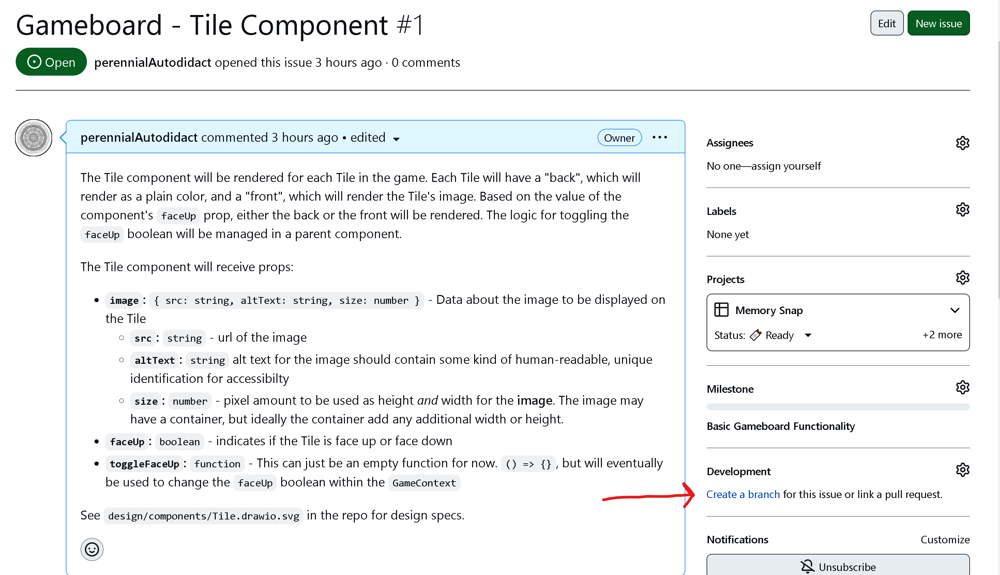
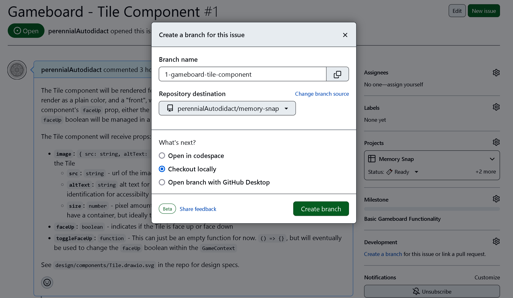

# Memory Snap
Flip tiles to find matching images. The player who finds the most pairs wins!

## Project Setup
- Run `git clone https://github.com/perennialAutodidact/memory-snap.git`
- Run
`cd memory-snap`
- Run `yarn install`
- Run `yarn start` to start the local dev server

The repo is setup to use absolute imports with the `src` as the base directory.
Any relative import that traverses more than one parent directory should be
changed to use absolute import syntax.

```javascript
// bad
import MyComponent from '../../../../components/MyComponent';

//good
import MyComponent from 'components/MyComponent';
```

## Styling
Styles are written in SCSS and are located in the `src/styles` directory. 

## Testing
Tests are written in Jest with React Testing Library. There is a helper
function
 named `setupTests` in `src/helpers/tests` which will render
components
 wrapped in the necessary context providers. This function should be
used instead
 of React Test Library's `render` function for rendering
components
 within tests.


The `setupTests` function accepts the following arguments:
`Component`: **React.ReactNode** - The component to be rendered in the test
`options`: **object** - values used to render the Component in a particular state
    - `props`: **object** - props for the Component
    - `state`: **object** - the current state of the application (currently this is the value that will be provided to `GameContext`)
    - `route`: **string** - url of route to be rendered (e.g. "/users/10")

Ideally, tests should be written for every single component and every single user action.
Mock as little as possible.

Run `yarn test` to start the test suite in watch mode.

## Contributing
All incoming feature branches will be merged into the `dev` branch to be tested in a staging environment before committing changes on the branch into `main`. 

Branches should be created for each issue. The branch name should be formatted like this: `{issue number}-{component}-{short-description}`. Please, use hyphens instead of spaces or other punctuation. Github has a feature for creating branches that will be linked to the issue for which they're created. Branches created in this way will follow the aforementioned branch name formatting. See the images below.


