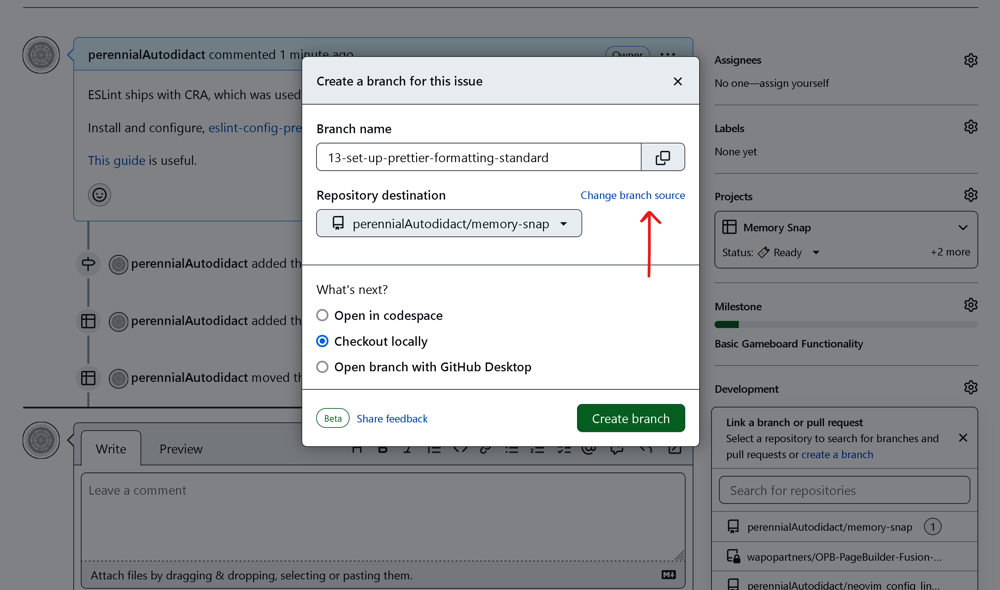
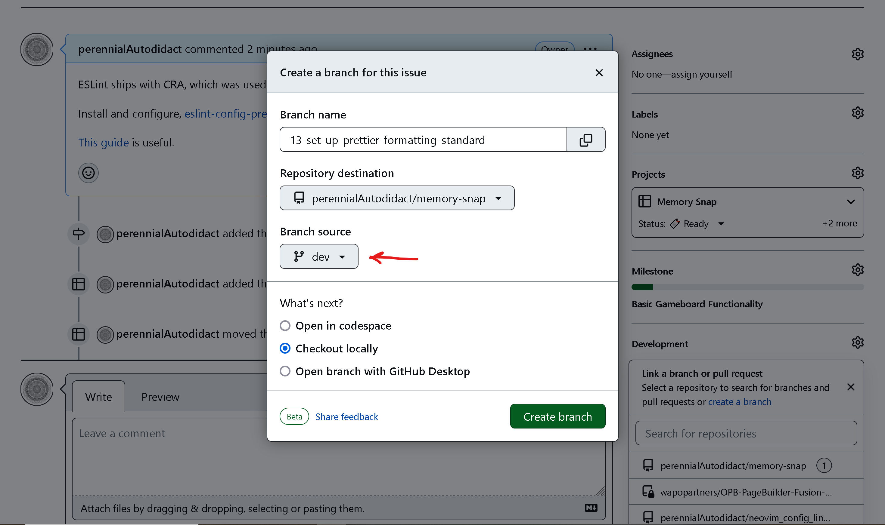

# Memory Snap
Flip tiles to find matching images. The player who finds the most pairs wins!

## Project Setup
This project uses Nx to manage a monorepo containing a backend server created with Express and a frontend application created with `create-react-app` (CRA).

- Install and/or switch to Node 18.17.1. 
- Run `git clone https://github.com/perennialAutodidact/memory-snap.git`
- Run `cd memory-snap`
- Run `yarn install` in the root directory, Nx will take care of installing dependencies for each package in the `packages` directory. If Yarn is not installed globally for Node 18.17.1, then install it using `npm install -g yarn`.
- Create a [Pexels](https://pexels.com) account and find the API key for the account
- Create the file `packages/backend/.env.local` and add the Pexel's API key to it: `PEXELS_API_KEY=<API_KEY>` where `<API_KEY>` is the API key string
- Create the file `packages/frontend/.env.local` and add: `REACT_APP_API_URL=http://localhost:8080`
- Create the file `.env.local` in the root directory and add: `API_PORT=http://localhost:8080` and `CLIENT_PORT=http://localhost:3000`
- Run `yarn start` to start the local dev server

## Styling
Styles are written in SCSS and are located in the `src/styles` directory.
[Bootstrap](https://getbootstrap.com/docs/5.0/getting-started/introduction/) is used as a foundation and custom values are applied in
`src/styles/_bootstrap-config.scss` and
`src/styles/_memory-snap-variables.scss`. Bootstrap variable overrides need to
be loaded **before** Bootstrap is imported into the project in
`src/styles/index.scss`.

## Testing
Tests are written in Jest with React Testing Library. There is a helper
function named `setupTests` in `src/helpers/tests` which will render
 components
wrapped in the necessary context providers. This function should be
 used
instead of React Test Library's `render` function for rendering  components
within tests.

The `setupTests` function accepts the following arguments:
`Component`: **React.ReactNode** - The component to be rendered in the test
`options`: **object** - values used to render the Component in a particular state
    - `props`: **object** - props for the Component
    - `state`: **object** - the current state of the application (currently this is the value that will be provided to `GameContext`)
    - `route`: **string** - url of route to be rendered (e.g. "/users/10")

Ideally, tests should be written for every single component and every single
user action **before** writing the code to fix the test. Mock as little as
possible to maximize test confidence. 

Run `yarn test` to start the test suite in watch mode.

## ImmerJS

Since React utilizes top-down, immutable state, it's best practice
to always return a new state object from the reducer to avoid stale state
within the app and to ensure that components update when state values change.
Using traditional spread operator syntax is effective, but gets very messy when
updating deeply nested state values, because each layer of the state object
needs to be duplicated as the deeply nested value is accessed.

[ImmerJS](https://immerjs.github.io/immer/) is a library used by Redux Toolkit
to allow immutable state updates to be written in a mutable syntax. The
`produce` function from Immer creates a `draft` of a given object, applies
mutable change to it and then returns a new object with the desired changes.

For example:
```javascript
// traditional reducer syntax, using spread syntax
const reducer = (state, action) => {
  switch(action.type){
    case types.SET_DEEPLY_NESTED_VALUE: {
      // return a copy of the state object with desired changes
      return {
        ...state,
        nested: {
          ...state.nested,
          deeplyNested: {
            ...state.nested.deeplyNested,
            value: action.payload.value, 
          },
        },
      }
    };
  };
};
```

In order to update the value of `state.nested.deeplyNested.value`, all the
previous layers of state need to be spread into the new object. This quickly
becomes difficult to read and maintain. With Immer, the previous example would
look like this:

```javascript
import produce from 'immer';

// using ImmerJS
const reducer = (state, action) => {
  switch(action.type){
    case types.SET_DEEPLY_NESTED_VALUE: {
      // return a copy of the state object with desired changes
      return produce(state, (draft) => {
        draft.nested.deeplyNested.value = action.payload.value;
      });
    };
  };
};
```

The `draft` object is able to be manipulated with mutable syntax and Immer
creates a new object behind the scenes with the desired changes. *No return
value is required from the `produce` function*.

See the [ImmerJs Docs](https://immerjs.github.io/immer/produce/) for more
information about the `produce` function.


## Contributing
All incoming feature branches will be merged into the `dev` branch to be tested
in a staging environment before committing changes on the branch into `main`. 

Branches should be created for each issue. The branch name should be formatted
like this: `{issue number}-{component}-{short-description}`. Please, use hyphens
instead of spaces or other punctuation. Github has a feature for creating
branches that will be linked to the issue for which they're created. Branches
created in this way will follow the aforementioned branch name formatting. See
the images below.
 

<<<<<<< HEAD

All new branches should be created using the `dev` branch as a base. Click
 the "Change branch source" link and select `dev` from the dropdown.


=======
>>>>>>> main
